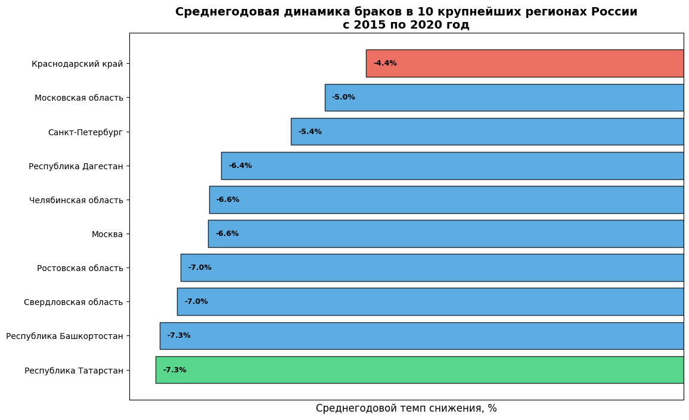
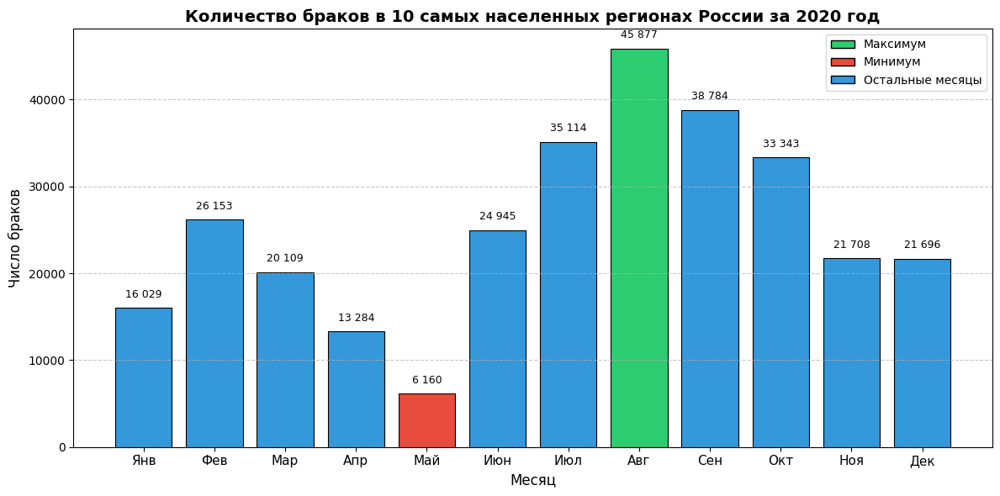
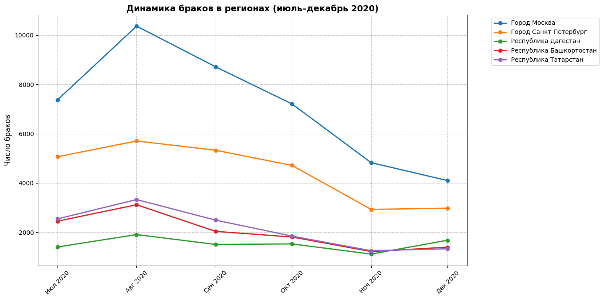
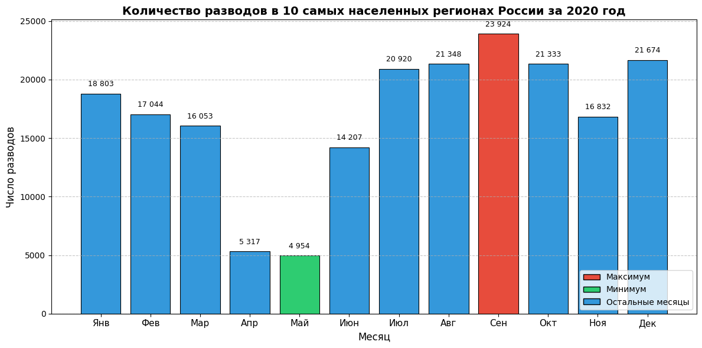

# Браки и разводы в России (2015-2020 гг): повлияла ли пандемия COVID-19 на институт семьи и брака (анализ данных 10 самых населенных регионов страны)

**Синопсис:** Институт брака и семьи является основной для формирования общества, но в последние годы соотношение браков и разводов стало 10:8. Мне показалось это интересным, поэтому я решила провести исследование на тему браков и разводов за 2015-2020 годы по 10 самым населенным регионам России, чтобы посмотреть их динамику и узнать, повлияла ли пандемия COVID-19 на это.

**Актуальность:** 2024 год был объявлен годом семьи, но разводов все равно стало почти столько же, сколько браков. Мне было интересно узнать больше: когда всё началось? 2020 год стал кризисным практически для каждого человека, но статистика показывает, что спад начался гораздо раньше. Понимая, как самые населенные регионы страны пережили кризис шесть лет назад, можно будет лучше понять как решать проблему с разводами, к чему начинать готовиться уже сейчас, когда демографическая ситуация стала еще острее.

### Исследовательские вопросы:
1. Каков был среднегодовой темп снижения числа браков в период с 2015 по 2020 год и в каких регионах из «десятки» лидеров наблюдается наиболее негативная динамика?
2. В какой именно месяц 2020 года произошло самое резкое сокращение числа регистраций браков по сравнению со средними показателями предыдущих пяти лет (2015–2019 гг.)?
3. Насколько быстро восстановилось количество свадеб во втором полугодии 2020 года и есть ли заметная разница в темпах этого восстановления между городами федерального значения (Москва, Санкт-Петербург) и национальными республиками?
4. Сохранились ли традиционные «пиковые» месяцы для заключения браков в условиях пандемии или привычный свадебный сезон в 2020 году существенно деформировался?

### Данные:
Файлы проекта находятся в папках [`data`](data) и [`scripts`](scripts):
- [`data/data1_raw.xls`](data/data1_raw.xlsx) — исходные данные по бракам в России: 14 строк, есть пропуски, лишние данные о статистике за квартал;
- [`data/data2_raw.xls`](data/data2_raw.xlsx) — исходные данные по разводам в России: 14 строк, есть пропуски, лишние данные о статистике за квартал;
- [`data/data(7).xls`](data/data(7).xlsx) — файл для работы таблицы браков с pandas;
- [`data/data(6).xls`](data/data(6).xlsx) — файл для работы таблицы разводов с pandas;
- [`data/data_clean.xls`](data/data_clean.xlsx) — очищенные данные по бракам и разводам в России: 25 строк, все пропуски заполнены. Форматы приведены к единому стандарту, таблицы соединены;
- [`scripts/visualisation.py`](scripts/visualisation.py) — файл с кодами, которые использовались для визуализации.

**Источники:**
1. ЕМИСС (Число зарегистрированных разводов (оперативные данные)) [https://www.fedstat.ru/indicator/33554](https://www.fedstat.ru/indicator/33554)
2. ЕМИСС (Число зарегистрированных браков (оперативные данные)) [https://www.fedstat.ru/indicator/33553](https://www.fedstat.ru/indicator/33553)

**Состав данных:**
**Процесс сбора и очистки:**
Я собрала данные из открытых публикаций ЕМИССа. Очистка была выполнена с помощью Excel:
* данные расположены от самого населенного к менее населенному региону из топ-10 по России

**Процесс визуализации данных (Python, pandas):**
* написание кода для первого графика «Среднегодовая динамика браков в 10 крупнейших регионах России с 2015 по 2020 год» (определение среднегодовых значений по каждому из выбранных для проекта регионов, перевод в проценты, обозначение цветом минимального и максимального показателя)
* написание кода для второго графика «Количество браков в 10 самых населенных регионах России за 2020 год» (выбор только 2020 года, вычисление количества всех разводов в 10 регионах, выделен максимальный и минимальный показатели)
* написание кода для третьего графика «Динамика браков в регионах (июль–декабрь 2020)» (выбор Москвы, Санкт-Петербурга и трех республик (Дагестан, Башкортостан, Татарстан) за вторую половину 2020 года, обозначение каждого региона своим цветом, указание численных показателей)
* написание кода для четвертого графика «Количество разводов в 10 самых населенных регионах России за 2020 год» (выбор только 2020 года, вычисление количества всех разводов в 10 регионах, выделен максимальный и минимальный показатели)

### Анализ:

График «Среднегодовая динамика браков в 10 крупнейших регионах России с 2015 по 2020 год» показывает, что за эти пять лет средний показатель количества браков снижался во всех регионах. В Краснодарском крае снижение составило 4,4%, в Республике Татарстан – более чем на 7,3% (в Республике Башкортостан на графике такой же показатель, но в реальности они отличаются на несколько долей; для удобства визуального восприятия я оставила только одну цифру после запятой). Это означает, что среднегодовой темп снижения браков был отрицательным везде, а наиболее сильная негативная динамика (наибольшее падение) наблюдалась в Татарстане и Башкортостане, наименее выраженная – в Краснодарском крае.

Пандемия COVID-19 официально началась с объявления ВОЗ 11 марта 2020 года, что привело к дистанционному обучению, карантину и уменьшению количества массовых мероприятий. В России режим самоизоляции начался 30 марта 2020 года, а ограничительные меры в большинстве регионов были введены с конца марта по начало апреля. Диаграмма показывает, что в мае этого года было заключено меньше всего браков (6160) – это и есть месяц самого резкого сокращения. Но уже к августу показатель увеличился до 45 877. Значит, карантинные меры практически никак не повлияли на свадьбы в 2020 году, ведь спад наблюдался только в мае, и он был временным и не означал отказ от браков.

Мне показалось важным рассмотреть динамику уже во второй половине 2020 года по регионам, но для наглядности взять только Москву, Санкт-Петербург и три республики (Дагестан, Башкортостан и Татарстан). В столице, где численность населения, очевидно, значительно выше, чем в других регионах, показатели выше. В августе было заключено более 10 тысяч браков, но к декабрю число падает до 4 тысяч. Жители Дагестана, наоборот, меньше всех (до 2 тысяч браков) играли свадьбы, и кривая практически не имеет критических спадов или подъемов, но, в отличие от Москвы, с ноября по декабрь показатели растут на 15%. Восстановление во втором полугодии произошло везде, но в городах федерального значения оно было более резким (пик в августе, затем спад), а в республиках – более плавным, без сильного падения к концу года. Таким образом, темпы восстановления различались: в Москве и Санкт-Петербурге индекс восстановления (относительно среднемесячных значений 2015–2019) достиг максимума в августе, а в республиках – немного позже, и снижение было менее выраженным. Обычно свадебный сезон в России приходится на июль–сентябрь, но в 2020 году он сдвинулся: максимум пришёлся на август, а сентябрь, хоть и оставался высоким, но уже не был рекордным. Май, обычно не самый востребованный месяц, из-за карантина стал самым низким. Значит, привычный свадебный сезон в год ковида существенно деформировался – ограничительные меры сместили браки на более поздние месяцы, но не убрали сезонный всплеск.

Интересно, что в сентябре 2020 года количество разводов самое высокое (23 924), а в мае, как и браков, самое низкое (4 954). Кажется, что карантин способствовал снижению разводов в 2020 году, поскольку на начало года пришлось практически 19 тысяч, а после введения мер цифры снизились более чем в четыре раза. Однако уже к сентябрю они не только восстановились, но и превысили значения начала года. Это подтверждает, что спад в мае был временным, а не реальным изменением семейного поведения.

Пандемия COVID-19 и введенные в 2020 году ограничительные меры не оказали однозначного негативного влияния на институт брака и семьи в России. Хотя в мае (месяц введения карантина) наблюдался резкий спад регистраций браков, уже к лету показатели не только восстановились, но и превысили средние значения: пик пришёлся на август. Падение в мае было временным отложением заключения браков, а не отказом от них. Долгосрочный тренд снижения числа браков (2015–2020гг) прослеживается во всех крупных регионах: сильнее всего – в Татарстане и Башкортостане, слабее – в Краснодарском крае. Пандемия же, скорее, деформировала сезонность, сместив традиционный свадебный сезон на август, но не изменила общую тенденцию к уменьшению количества браков. Таким образом, COVID-19 в 2020 году не стал кризисным для института семьи и брака, а только временно скорректировал помесячную динамику, не нарушив устоявшихся региональных особенностей и многолетнего тренда.

### Референсы:
1. [https://t-j.ru/stat-divorce/](https://t-j.ru/stat-divorce/)
2. [https://wciom.ru/analytical-reviews/analiticheskii-obzor/razvody-v-rossii-monitoring](https://wciom.ru/analytical-reviews/analiticheskii-obzor/razvody-v-rossii-monitoring)
3. [https://trends.rbc.ru/trends/social/67eb9ba7947165b574ab9](https://trends.rbc.ru/trends/social/67eb9ba7947165b574ab9)

### Инструменты
- **Google Таблицы** — для просмотра и первичной работы с данными;
- **Excel (.xlsx)** — для хранения таблицы;
- **Python3 ( pandas, )** — для дополнительной обработки данных и графического построения;
- **Markdown** — для оформления `README.md`. 
- **GitHub** — для публикации проекта;
